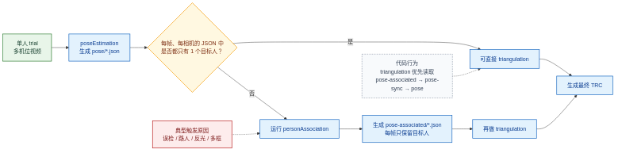
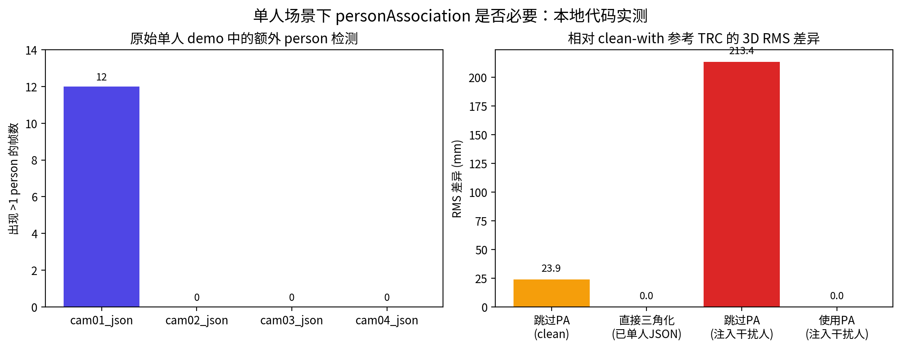

# 单人场景下是否需要 personAssociation：本地研究记录

该目录记录“单人场景下 `personAssociation` 是否必要”的本地代码研究证据。

它面向 PR 描述、代码审阅和结果回溯，不是最终用户的入门文档。面向用户的说明见：

- `docs/single-person-personassociation.md`

## 研究问题

问题不是“代码能不能不跑 `personAssociation`”，而是更细一点：

1. 如果输入 JSON 已经是单人，跳过 `personAssociation` 会不会影响最终 TRC？
2. 如果原始单人场景的 JSON 里混入了额外 person，跳过 `personAssociation` 会不会明显出错？

## 代码阅读结论

代码层面的关键点有两个：

- `triangulation` 会优先读 `pose-associated`，没有时会回退到 `pose-sync`，再没有就读 `pose`
- `personAssociation` 在单人模式下，会用 `tracked_keypoint` 的重投影误差从多相机多候选 person 中选出目标人，并写成 `pose-associated/*.json`

因此：

- `personAssociation` 不是三角化的硬依赖
- 它的主要价值是把“原始 pose JSON 中可能存在的多 person 候选”压成“每帧每相机一个目标人”

## 实验设置

基础数据：

- 数据来源：`Pose2Sim/Demo_SinglePerson`
- 处理帧段：`[0, 12)`
- 标定：由 `Calib.qca.txt` 转换成 `.toml`
- pose 设置：`lightweight`、`openvino`、`cpu`、`det_frequency = 1`
- triangulation 设置：`make_c3d = false`、`min_chunk_size = 1`

基础步骤：

1. 跑 `Pose2Sim.calibration('.')`
2. 跑 `Pose2Sim.poseEstimation('.')`
3. 基于同一套 `pose/*.json` 复制出多个实验分支

## 对照组设计

### A. clean-skip

- 使用原始 `pose/*.json`
- 不跑 `personAssociation`
- 直接跑 `triangulation`

### B. clean-with

- 使用原始 `pose/*.json`
- 先跑 `personAssociation`
- 再跑 `triangulation`

### C. oracle-single-direct

- 先用 `clean-with` 得到 `pose-associated/*.json`
- 再把这套“已经只剩一个目标人”的 JSON 直接当作 `pose/*.json`
- 不跑 `personAssociation`
- 直接跑 `triangulation`

这个组专门回答“如果 JSON 已经只有一个人，还要不要 `personAssociation`”。

### D. distractor-skip / distractor-with

- 在 `frames 3..8` 中，给 4 路相机的 JSON 人工注入一个错误的额外 person
- 做法是把真实人的 keypoints 复制一份，并施加相机相关的平移偏置，然后把这个错误 person 插到 `people[0]`
- 之后分别测试：
  - 跳过 `personAssociation`
  - 保留 `personAssociation`

## 核心观测

### 原始单人 demo 的 pose JSON 并不总是单人

`metrics.json` 显示：

- `cam01_json`：`12/12` 帧出现 `>1 person`
- `cam02_json`：`0/12`
- `cam03_json`：`0/12`
- `cam04_json`：`0/12`

也就是说，这个研究问题在真实单人 demo 上就已经成立，不是纯合成问题。

### 已经变成单人 JSON 时，跳过 personAssociation 完全不影响 TRC

`oracle-single-direct_vs_clean_with` 的差异是：

- RMS：`0.0 mm`
- 平均 marker 距离：`0.0 mm`
- 最大距离：`0.0 mm`

这说明：

- 如果每帧每相机的输入 JSON 已经只剩目标人，`personAssociation` 可以省掉

### 原始 JSON 含额外 person 时，跳过 personAssociation 会让 TRC 偏掉

对照 `clean-with`：

- `clean-skip`：RMS 差异 `23.9 mm`
- `distractor-skip`：RMS 差异 `213.4 mm`
- `distractor-with`：RMS 差异 `0.0 mm`

## 图

流程判断图：

实测结果图：

## 关键结果表

| 条件 | 相对 clean-with 参考 TRC 的 RMS 差异 |
| --- | ---: |
| clean-skip | 23.9 mm |
| oracle-single-direct | 0.0 mm |
| distractor-skip | 213.4 mm |
| distractor-with | 0.0 mm |

## 产物

- `metrics.json`：实验指标汇总
- `trc-comparison.csv`：TRC 差异表
- `selected-log-excerpts.txt`：关键日志摘录

## 结论

最稳妥的结论是：

- 如果输入 JSON 已经被约束成“每帧每相机一个目标人”，单人场景下可以跳过 `personAssociation`
- 但如果只是“场景里只有一个人”，而原始 pose JSON 仍可能混入额外 person，那么建议保留 `personAssociation`

这次实跑里，这两件事都被代码和数据同时验证了。
